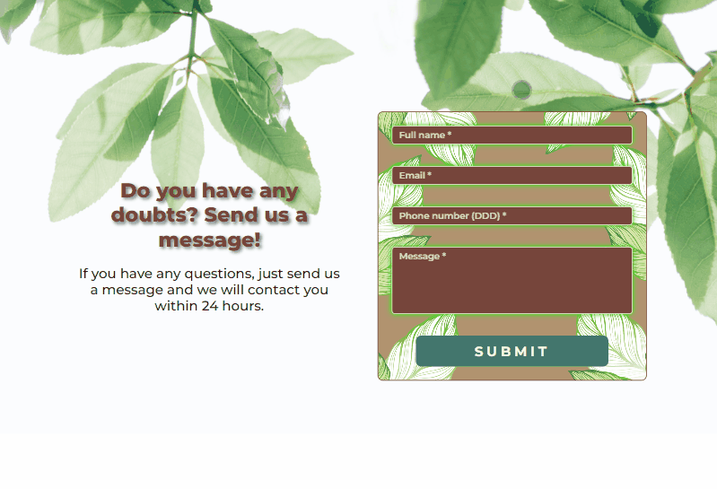
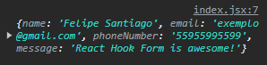
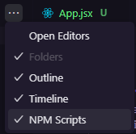

# Projeto pessoal de React-Hook-Form

🧾✍ Esse é um projeto utilizando a biblioteca React: [React-Hook-Form](https://react-hook-form.com).


## Sumário

- [Visão Geral](#visão-geral)
  - [Objetivos](#objetivos)
  - [Screenshot e gifs](#screenshot-e-gifs)
- [Meu processo](#meu-processo)
  - [Tecnologias utilizadas](#tecnologias-utilizadas)
  - [Funcionalidade do projeto](#funcionalidade-do-projeto)
  - [Como executar o projeto](#como-executar-o-projeto)
  - [Agradecimentos](#agradecimentos)
  - [Recursos úteis](#recursos-úteis)
- [Autor](#autor)


## Visão-geral

### Objetivos

Objetivos do projeto:

- Criar um formulário com validação, que verifica o preenchimento correto dos dados e só envia os dados do usuário após a conferência a autorização dos dados.
- Caso os dados estejam inválidos ou algum campo vazio, uma mensagem de campo requerido aparece.
- Após envio do formulário, os dados devem ser coletados (aqui, no caso, através do console)

### Screenshot e gifs

#### Funcionalidade do projeto



#### Responsividade do projeto


## Meu processo

### Tecnologias utilizadas

- JSX
- JavaScript
- React
- Vite
- React Hook Form

### Funcionalidade do projeto

A bilbioteca [React-Hook-Form](https://react-hook-form.com) nos permite realizar verificações mais profundas de nossos formulários, de uma forma fácil de ser compreendida e de dar manutenção.
De forma resumida, essa biblioteca vai precisar dos seguintes dados do método ```useForm()```

```jsx
const Form = () => {
  const { register, formState: { errors }, handleSubmit } = useForm();
}
```

- Register: 

É uma função que define o nome/chave de cada input para registro. É utilizado um **Rest-Operator** e, em seguida, o parâmetro para o método "register" é o **name** do input.


```jsx
<input {...register('name')}>
```

- formState: { errors }

do formState nós utilizamos o objeto **errors** que será utilizado para coletar a mensagem de erro do register e, caso um erro seja identificado, essa mensagem será mostrada.

```jsx
<input
{...register('name', { required: "Required field" })} />
<div className="errorMessage">
    <p>{errors.name?.message}</p>
</div>
```

- handleSubmit

Ele é uma função, que terá como parâmetro outra função que precisamso criar que será executada quando o formulário estiver completamente preenchido de forma correta.
O handleSubmit impede que o formulário seja enviado antes do seu preenchimento correto.
No caso do meu projeto eu apenas coletei os dados com um console.log.

```jsx
const handleSubmitForm = (data) => {
    console.log(data);
}

<form 
    className="form" 
    onSubmit={handleSubmit (handleSubmitForm)}>
</form>
```
#### Dados coletados após submit do formulário no console


### Como executar o projeto

- O projeto foi realizado através do [React-Vite](https://vitejs.dev).

- Ao baixar o projeto, abrir o terminal do VSCode e digitar o código de instalação das dependências: **npm install**

- O arquivo package.json já possui a versão da biblioteca em seus dados, portanto o react-hook-form será baixado na sua máquina da mesma forma. Mas caso tenha interesse em baixa-lo em outro projeto, simplesmente digite no terminal: **npm install react-hook-form** (Todas as informações se encontram na documentação do [React-Hook-Form](https://react-hook-form.com))

- Para rodar o projeto no navegador é necessário ativar o **NPM Scripts** nos três pontos ao lado do EXPLORER do VSCODE



- Em seguida, na janela inferior esquerda do **NPM SCRIPTS** clicar no botão **run** do package.json/dev vite


- Por fim, no terminal irá aparecer o **local-host** que será executado no seu navegador o projeto. Passe o mouse sobre ele e clique em **Follow link** ou pressione o botão **ctrl** do seu teclado e clique em cima do **local-host** e a página abrirá no seu navegador padrão.


## Autor

- GitHub - [Felipe Santiago Morais](https://github.com/SantiagoMorais)
- Linkedin - [Felipe Santiago](https://www.linkedin.com/in/felipe-santiago-873025288/)
- Frontend Mentor - [@FelipeSantiagoMorais](https://www.frontendmentor.io/profile/SantiagoMorais)
- Instagram - [@felipe.santiago.morais](https://www.instagram.com/felipe.santiago.morais)
